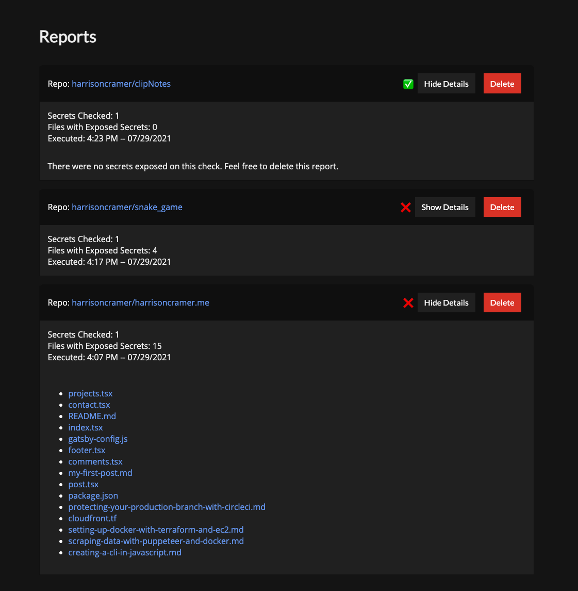

# 🤫 Quiet.sh

This project is designed to help users keep track of sensitive tokens or passwords inside of their Github repositories.

By signing in, users can query their repos and create reports of any offending files, allowing them to quickly take action upon detection of a key exposure.

The backend of the project is written in Typescript, the frontend is React.

I'm happy to take pull requests however this project is not yet production ready and should not be relied upon for serious workflows. Due to a limitation in Github's codes-searching API, the project also only now searches the master branch.

## Security

This project does not store any of your secrets inside of the database, it only uses them as initial requests to Github's API when searching. They are then discarded.

## Future Development

If I've got time, I may come back to this project and add an additional layer of security checking, for instance with <a href="https://github.com/zricethezav/gitleaks">gitleaks</a> or another comparable open-source tool.
